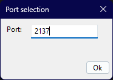
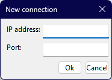
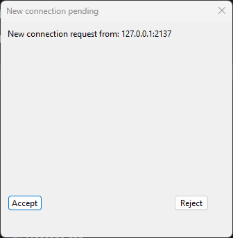
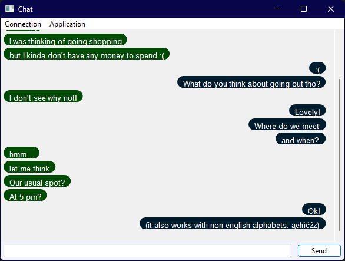

Simple chat application project
===============================

Technologies and libraries used
-------------------------------

1. **C++**
2. **Boost Asio** - used for socket based network programming.
3. **wxWidgets** - used for creating the UI. I am aware it is quite obsolete, but I opted for it for its simplicity, as it allowed me to create the UI using only C++ code.

Functionalities
---------------

The app allows you to communicate with another host (be it local or remote), by providing their port and ip address. When running the application, you are required to provide a port on which the application will be functioning.
If you produce a port number that is occupied (ie. cannot be claimed by the application), it will crash - no point in running without a socket! If you successfully enter the port number to be used, the application runs an acceptor
in the background. Should a connection request come, the user will be prompted to either accept it or reject. If accepted, the users can now exchange messages.

Screenshots
-----------
The program begins by displaying the port selection dialog modally.

Then the user can connect to another instance of the application, by selecting Connection>Connect (or Ctrl-N)

The other user is prompted to accept (or reject) the incoming connection

The users can now exchange messages!

